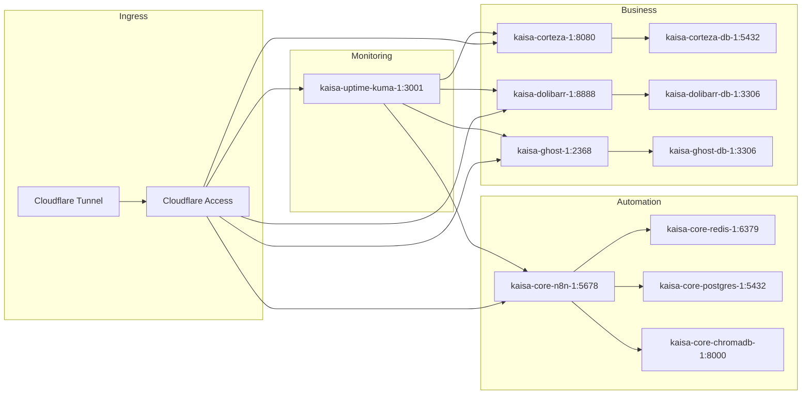

## Kaisa Labs Stack Map — Updated 2026-06-29

### Layer 0: Infrastructure
- Current: WSL2 Ubuntu (Production Hardened)
- Target: Hetzner CX42 (8 vCPU, 16GB RAM, 320GB SSD)
- Orchestration: Docker Compose v2
- Ingress: Cloudflare Tunnel (zero-trust) + Cloudflare Access Policy (OTP/Email)

### Layer 1: Core Services (Tier 0+1)

### External Integrations
- Cal.com (Cloud - Discovery Call)
- Formspree (Portfolio Form Bridge)
- Beehiiv (Newsletter - Pending)

### Layer 2: Post-Migration (Tier 2)
- Gitea (git.privacyfirstautomation.com)
- BookStack (docs client portal)
- DocuSeal (kontrak digital)
- Open WebUI (AI Interface)

### Layer 3: Agentic (Tier 3)
- CrewAI (multi-agent audit)
- PydanticAI (monitoring agent)

### Data Flow
1. Client → Cloudflare Tunnel → Cloudflare Access → 127.0.0.1:PORT
2. n8n workflow → PostgreSQL (State) / ChromaDB (RAG) → Ollama (local LLM via host.docker.internal)
3. Backup: nightly → D:\BACKUPS\DB → encrypted archive
4. Alert: Uptime-Kuma → Telegram webhook

### Constraint Mapping
- Port binding: 127.0.0.1:PORT (Rule 05)
- Restart: unless-stopped (Rule 06)
- Logging: json-file max-size=10m max-file=3 (Rule 07)
- Project name: kaisa-[service] (Rule 12)
