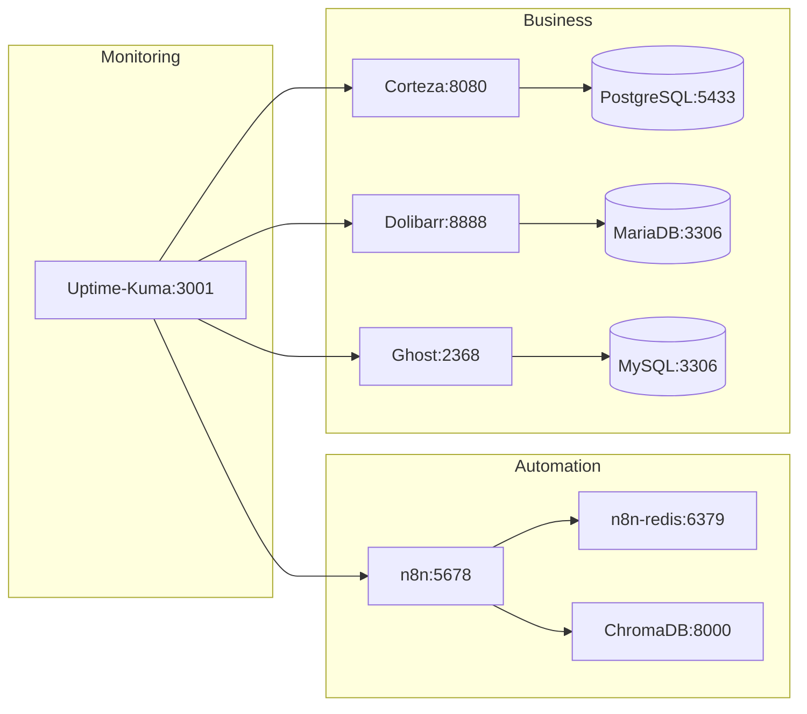

## Kaisa Labs Stack Map — 2026-05-30
### Layer 0: Infrastructure
- Docker Compose v2 (orchestration)
- Cloudflare Tunnel (ingress, zero-trust)
- Hetzner CX42 target (8 vCPU, 16GB RAM, 320GB SSD)

### Layer 1: Core Services (Tier 0+1)

### Layer 2: Post-Migration (Tier 2)
- Gitea (git.privacyfirstautomation.com)
- BookStack (docs client portal)
- DocuSeal (kontrak digital)
- Cal.com (booking)

### Layer 3: Agentic (Tier 3)
- CrewAI (multi-agent audit)
- PydanticAI (monitoring agent)

### Data Flow
1. Client → Cloudflare Tunnel → 127.0.0.1:PORT
2. n8n workflow → ChromaDB (RAG) → Ollama (local LLM)
3. Backup: nightly → /backups/ → encrypted archive
4. Alert: Uptime-Kuma → Telegram webhook

### Constraint Mapping
- Port binding: 127.0.0.1:PORT (Rule 05)
- Restart: unless-stopped (Rule 06)
- Logging: json-file max-size=10m max-file=3 (Rule 07)
- Project name: kaisa-[service] (Rule 12)
