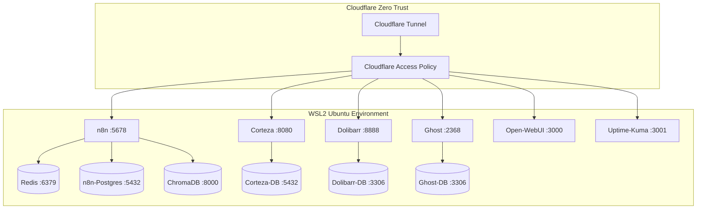

## Stack Architecture — Kaisa Labs v2 (WSL2 Production)

## Healthcheck & Constraint Mapping
- Ghost: `nc -z 127.0.0.1 2368` (TCP bypass redirect/SSL)
- ChromaDB: `/proc/net/tcp :1F40` (Hex 8000)
- Port binding: `127.0.0.1:PORT` (Rule 05)
- Restart: `unless-stopped` (Rule 06)
- Logging: `json-file max-size=10m max-file=3` (Rule 07)
- Project name: `kaisa-[service]` mandatory (Rule 12)
